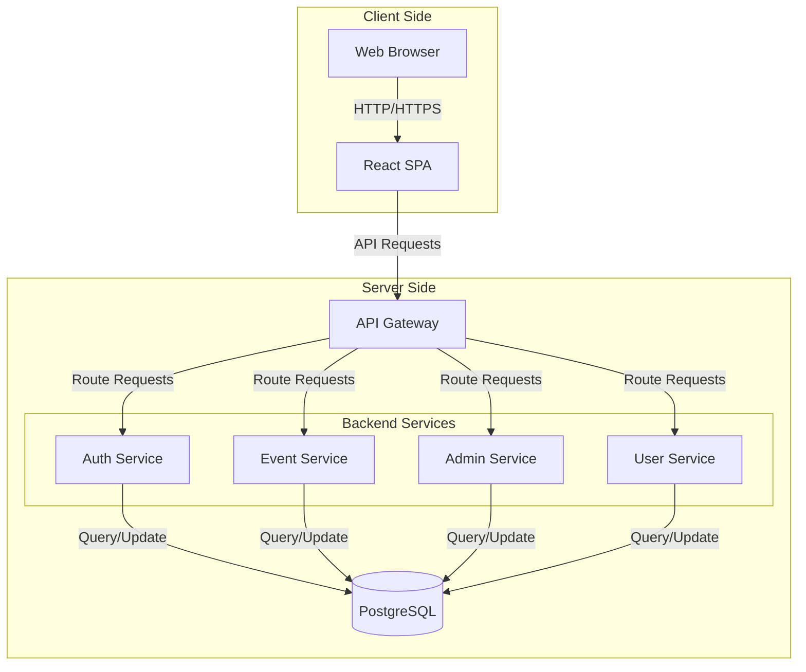
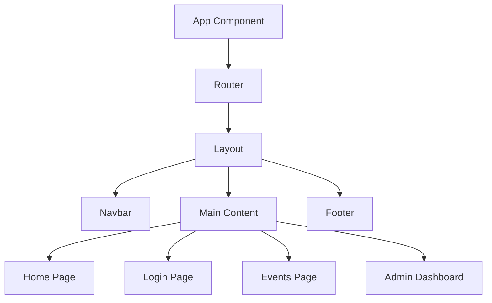
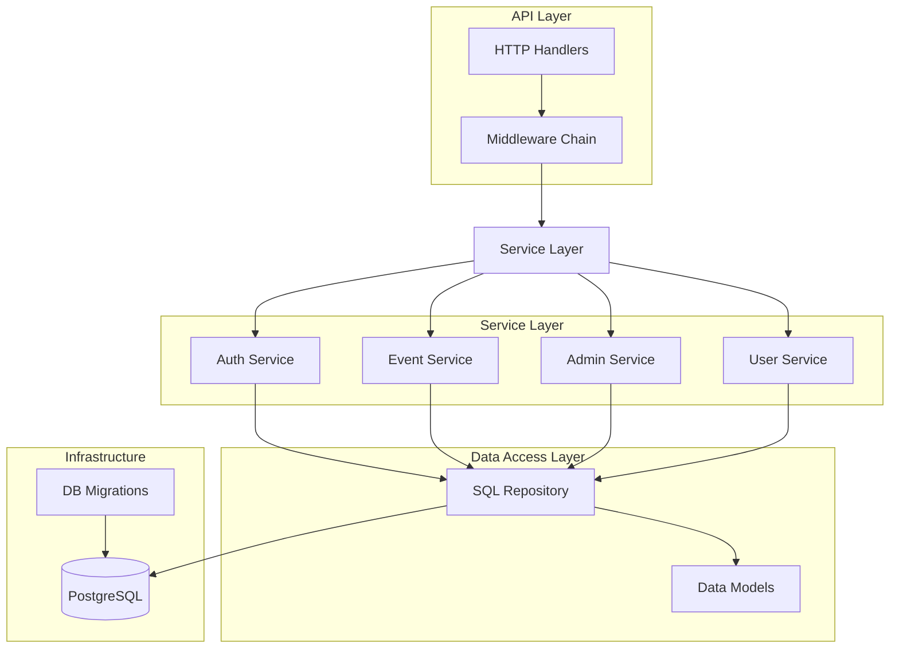
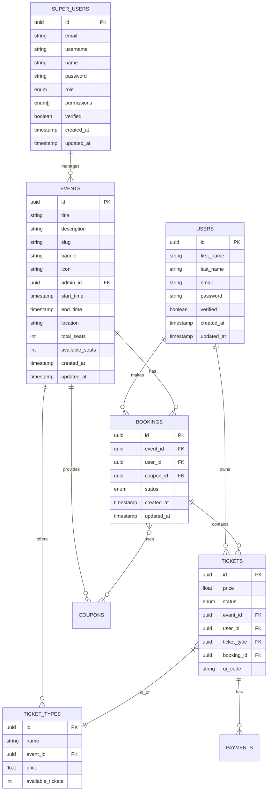
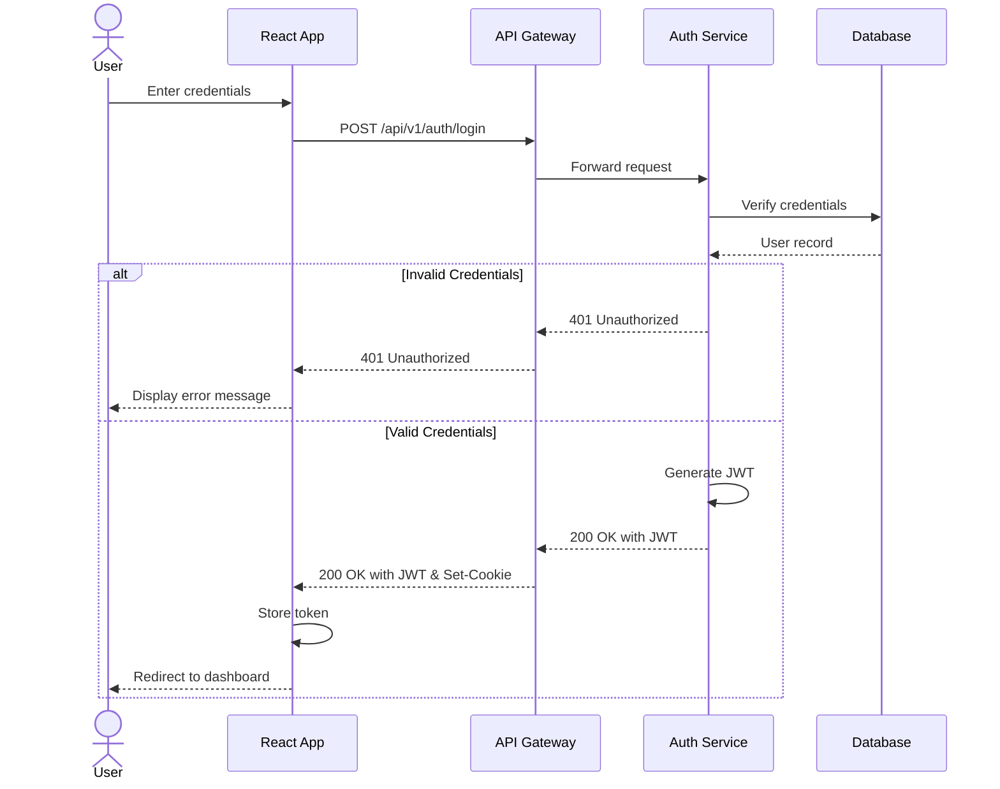
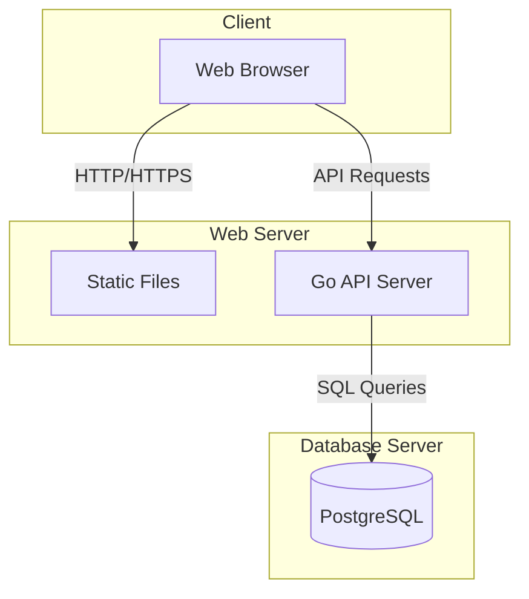

# Everato Platform Architecture

## System Overview

Everato is a modern event management platform built with a decoupled architecture consisting of a Go backend API and a React frontend. This document outlines the high-level architecture, component interactions, and technical decisions that shape the platform.

## Architectural Diagram

## Technology Stack

### Frontend
- **Framework**: React with TypeScript
- **Build Tool**: Vite
- **Routing**: React Router v7
- **Styling**: Tailwind CSS
- **API Communication**: Fetch API

### Backend
- **Language**: Go
- **Web Framework**: Custom with Gorilla Mux
- **Database**: PostgreSQL
- **ORM**: sqlc for type-safe SQL
- **Authentication**: JWT-based auth

## Component Breakdown

### Frontend Components

The React application follows a component-based architecture with the following structure:

#### Key Frontend Components:

1. **Layout Components**
   - `Layout.tsx`: Main layout wrapper that provides consistent structure
   - `Navbar.tsx`: Navigation component with routing links
   - `Footer.tsx`: Footer with site information and links

2. **Page Components**
   - `HomePage.tsx`: Landing page for the application
   - `LoginPage.tsx`: Authentication page for users
   - Event-related pages for listing, creating, and managing events

3. **Route Configuration**
   - Client-side routing handled by React Router
   - Path definitions in `routes.tsx`

### Backend Components

The Go backend is organized into several logical services, each handling specific domain functionality:

#### Key Backend Components:

1. **HTTP Handlers**
   - REST API endpoints organized by resource
   - JSON request/response handling
   - Error handling and status codes

2. **Middleware**
   - Authentication and authorization
   - Request logging
   - CORS handling
   - Request timeout management

3. **Services**
   - Business logic implementation
   - Transaction management
   - Domain-specific validation

4. **Data Access Layer**
   - Type-safe SQL queries using sqlc
   - Repository pattern for database operations
   - Data models representing database entities

## Database Schema

The PostgreSQL database schema includes the following key tables:

## Authentication Flow

## API Integration

The React frontend communicates with the Go backend through RESTful API endpoints. Key integration points include:

1. **Authentication**
   - Login: `POST /api/v1/auth/login`
   - Refresh Token: `POST /api/v1/auth/refresh`
   - Email Verification: `GET /api/v1/auth/verify-email?uid={user_id}`

2. **Events**
   - List Events: `GET /api/v1/events/all`
   - Create Event: `POST /api/v1/events/create`
   - Update Event: `PUT /api/v1/events/update`

3. **Admin Operations**
   - Admin Login: `POST /api/v1/admin/login`
   - Create Admin: `POST /api/v1/admin/create`
   - Get All Admins: `GET /api/v1/admin/all`

## Deployment Architecture

The deployment strategy involves:
1. Building the React application into static files
2. Serving these static files alongside the API server
3. Configuring the server to route API requests to the Go backend
4. Setting up appropriate database connections and security

## Development Workflow

The development workflow involves:

1. **Frontend Development**
   - Running the React dev server with hot reloading
   - Implementing components and pages based on designs
   - Connecting to API endpoints for data fetching and mutations

2. **Backend Development**
   - Implementing API endpoints and business logic
   - Running database migrations for schema changes
   - Testing API endpoints with tools like Postman or curl

3. **Integration**
   - Ensuring API contracts are maintained
   - Testing end-to-end flows across frontend and backend
   - Verifying authentication and authorization works correctly

## Future Considerations

1. **Scalability**
   - Consider breaking down monolithic backend into microservices
   - Implement caching strategies for frequently accessed data
   - Add load balancing for horizontal scaling

2. **Frontend Enhancements**
   - Add state management with Redux or Context API
   - Implement code splitting for improved load times
   - Add comprehensive error handling and recovery

3. **Security Enhancements**
   - Implement rate limiting for API endpoints
   - Add CSRF protection for sensitive operations
   - Regular security audits and penetration testing

This architectural overview provides a high-level understanding of how the Everato platform is structured, with particular emphasis on the integration between the React frontend and Go backend components.
