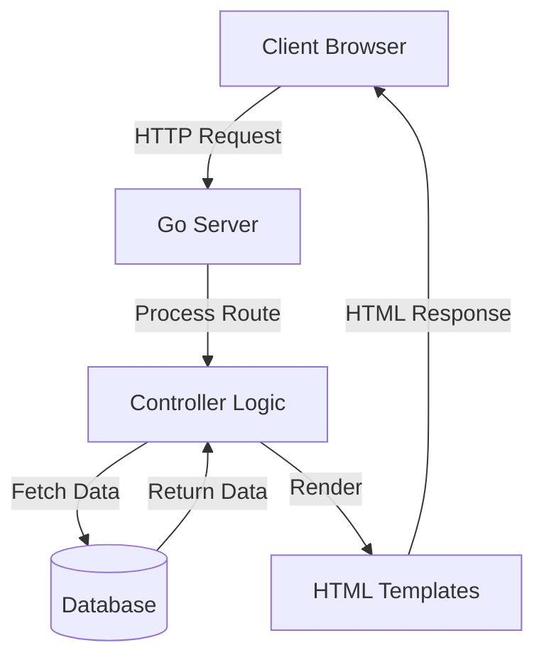
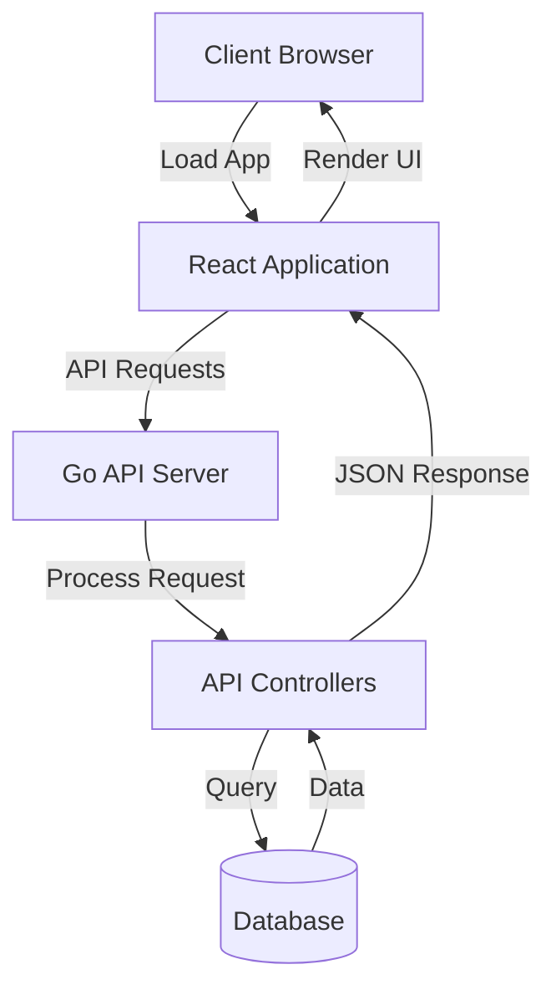
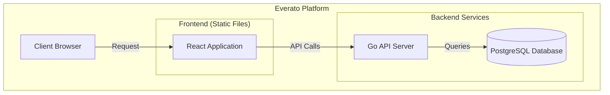

# UI Migration: From Server-Side Templates to React

## Overview

This document outlines the migration of Everato's user interface from server-side rendered HTML templates to a modern React-based frontend. This architectural change represents a significant shift in how the application renders and manages UI components, moving from a monolithic approach to a more decoupled frontend/backend architecture.

## Previous Architecture

Previously, the application used server-side HTML templates (likely using Go's `html/template` package or a templating engine like `templ`) to render views directly from the backend. This approach had several characteristics:

- Templates were processed and rendered on the server
- Each page request required a full page reload
- UI logic was tightly coupled with backend logic
- Limited interactivity without additional JavaScript



## New Architecture

The new architecture adopts a more modern, decoupled approach with a React frontend that communicates with the backend API:

- Single-page application (SPA) built with React
- Backend serves API endpoints instead of HTML
- Frontend and backend can evolve independently
- Enhanced user experience with client-side routing
- Improved interactivity and state management



## Key Components of the React Frontend

### Directory Structure

```
everato/www/
├── public/         # Static assets
├── src/
│   ├── components/ # Reusable UI components
│   ├── pages/      # Page components
│   ├── app.tsx     # Main application component
│   ├── main.tsx    # Application entry point
│   ├── routes.tsx  # Route definitions
│   └── index.css   # Global styles
```

### Core Components

1. **Layout Components**
   - `Layout.tsx` - Main layout wrapper with navbar and footer
   - `Navbar.tsx` - Top navigation bar
   - `Footer.tsx` - Site footer

2. **Page Components**
   - `HomePage.tsx` - Landing page for the application
   - `LoginPage.tsx` - Authentication page

3. **Routing**
   - React Router v7 for client-side routing
   - Routes defined in `routes.tsx`
   - Browser router initialized in `main.tsx`

## Integration with Backend

The React frontend communicates with the Go backend through API endpoints. Key integration points include:

- Authentication via `/api/v1/auth/login` endpoint
- Health checks via `/api/v1/health` endpoint
- API responses in JSON format
- Cookies used for maintaining session state

## Benefits of the Migration

1. **Improved User Experience**
   - Faster perceived performance with client-side routing
   - More responsive UI with state updates without page reloads
   - Modern, app-like feel with smooth transitions

2. **Development Efficiency**
   - Separation of concerns between frontend and backend
   - Specialized teams can work independently
   - Easier to implement complex UI interactions
   - Better tooling support with React's ecosystem

3. **Maintainability**
   - Clearer separation of UI logic and business logic
   - Component-based architecture promotes reuse
   - Easier to test UI components in isolation

4. **Scalability**
   - Backend can focus on data and business logic
   - Frontend can scale independently
   - Potential for better caching strategies

## Implementation Details

### Backend Changes

- Endpoints now return JSON instead of rendering HTML
- CORS middleware added to allow cross-origin requests
- Authentication tokens returned as both cookies and JSON responses

### Frontend Implementation

- React application bootstrapped using Vite
- Tailwind CSS for styling
- Component structure follows modern React best practices
- Fetch API used for communication with backend

## Deployment Architecture

The new deployment architecture involves serving the React application as static files alongside the API server:



## Future Considerations

1. **State Management**
   - Implement Redux or Context API for global state management
   - Consider React Query for data fetching and caching

2. **Performance Optimization**
   - Implement code splitting and lazy loading
   - Optimize bundle size with tree shaking

3. **Offline Support**
   - Service workers for caching and offline functionality
   - Progressive Web App (PWA) features

4. **Testing Strategy**
   - Unit tests for components with React Testing Library
   - End-to-end tests with Cypress

## Conclusion

The migration from server-side HTML templates to a React-based frontend represents a significant modernization of the Everato platform. This architectural change allows for a more interactive, responsive user experience while also providing benefits for development efficiency and maintainability.

By separating the frontend and backend concerns, the platform is better positioned for future growth and feature development, with each layer able to evolve independently according to its unique requirements.
